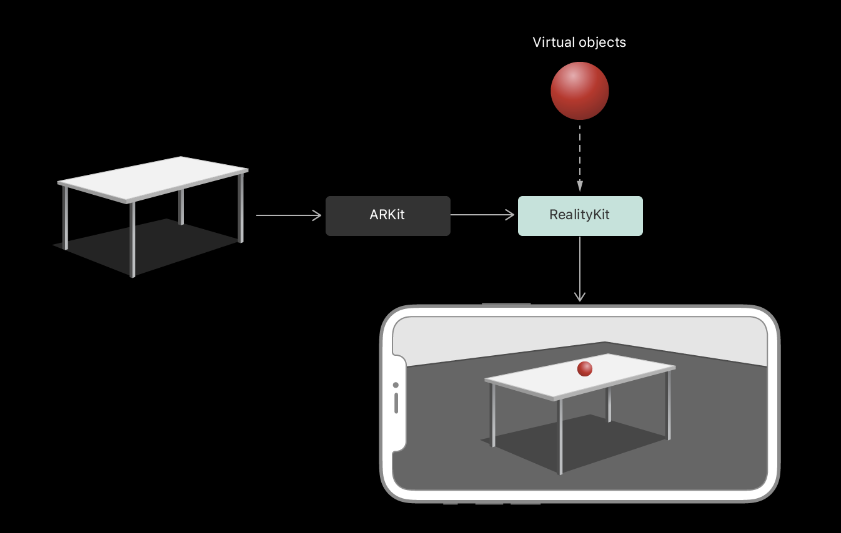
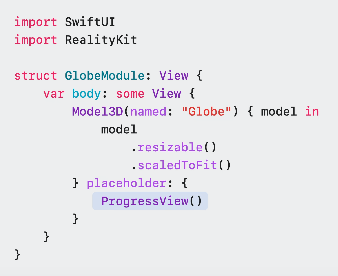
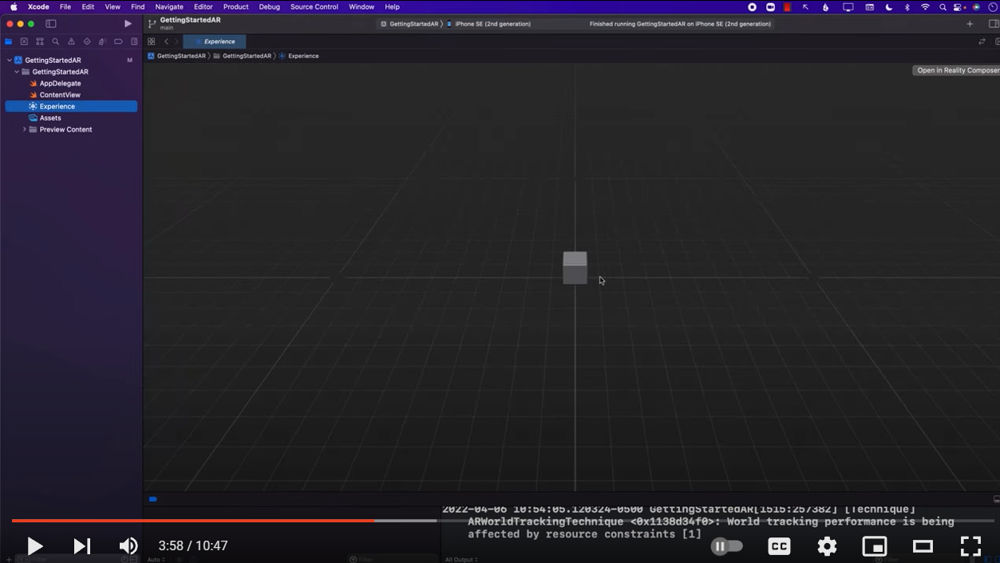

# Entry 2
##### 12/18/23

As I continue my research on Apple's augmented reality SDK named RealityKit, I come across many videos and documents. I have read in depth about RealityKit and the apple website gives a simple explaination on how it works.

This image above is [provided by Apple](https://developer.apple.com/documentation/realitykit/) and it easily explained to me that ARKit is just a way to analyze and display whatever you are looking at on your phone screen. RealityKit then processes that image and information to make the virtual object come to life using information about the table, size, and the speed at which the camera is moving.

I also watched [apple's video of someone introducing SwiftUI and RealityKit](https://developer.apple.com/videos/play/wwdc2023/10080/).
He explains how everything works and then he made an app that displays a window in an augmented reality scene. He then made it so the window would display a 3d object. In his case, he added a globe to the assets and initialized it through the code like this:

`Model3D(named: "Globe") { model in model .resizable() .scaledToFit()}` is the code that intializes the globe inside of the 3D space.

Through this [video](https://www.youtube.com/watch?v=Fd_0gtV8RiY) I found more about how I can use RealityKit and I found out that it has a 3 dimensional plane that can be displayed on xCode like this

I came across an issue when I opened it on my own device because the school issued macbook started to struggle when I put a lot of assets into the workspace. It eventually crashed and I couldn't go any further than that. I might consider switching to another tool or project.

I plan to learn more about my project then start to experiment more with RealityKit. I also will try to find a way around this problem of the school macbook being unable to run what I want it to run. I plan to get started with the UI which will display on RealityKit then afterwards I will move on to displaying some more complicated models like meshes and stuff. I will also learn how to create timers and functions that will run my game.

[Previous](entry01.md) | [Next](entry03.md)

[Home](../README.md)
